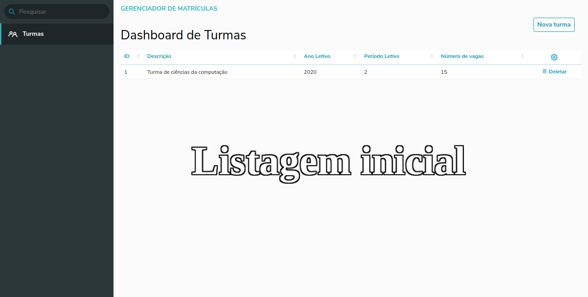
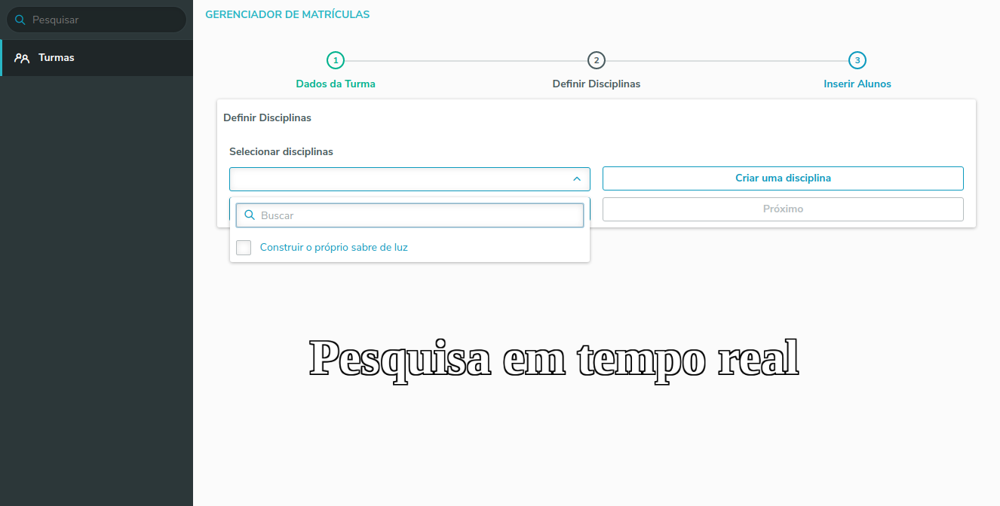
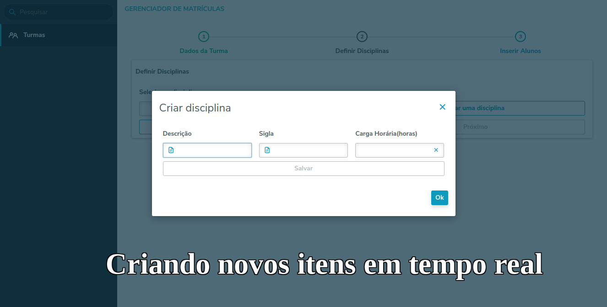

# Treinamento de Frontend com Angular + Portinari UI

##### Repositório destinado a treinamento das tecnologias frontend Angular e Portinari UI.

O desafio se trata de um setup wizard para abertura de turmas de umas escola qualquer *[Escolhi uma escola de Jedi para variar]*.

##### Mini-desafios
 * Uma turma pode ter muitos alunos e disciplinas.
 * Caso o aluno não exista, pode ser criado em tempo real
 * Caso a disciplina não existe, pode ser criado em tempo real

##### Resultado Atual:

